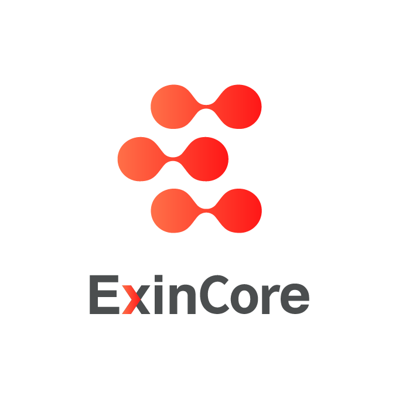
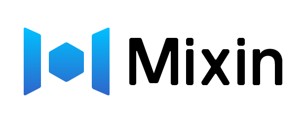

<p align="center"></p>

# ExinCore


ExinCore is a decentralized **instant exchange platform** built on Mixin Network, to use ExinCore, just send a asset transfer to ExinCore, ExinCore will auto use API to trade in exchange like `Binance`, `Huobi Global`, `BigOne`, `Okex`, `FCoin`, ruturn to pay account after exchange, complete within 1 second.

All order and trade data are encoded in the Mixin snapshots' memo field, the memo is base64 encoded MessagePack.

ExinCore is available to professional users with programming skills, general user will not only enjoy the Instant-Exchange service, but also the OTC service with ExinOne (https://exinone.com).


## Features

- **Safe**: decentralized exchange, keeping assets by yourself, and no need to trust ExinCore.
- **High Liquidity**: every exchange pair will connect to the best liquidity exchange to ensure market price.
- **Free**: Mixin Network is a free and lightning fast peer-to-peer transactional network for digital assets.
- **Fast**: API to exchanges trade, complete the transaction within 1 second.
- **Cross-chain**：ExinCore can support all assets supported by the Mixin Network, now support `BTC` `ETH` `BCH` `EOS` `USDT` and so on.


## Create Order

To exchange 10USDT to BTC, send a 10USDT transfer to ExinCore (61103d28-3ac2-44a2-ae34-bd956070dab1) with base64 encoded MessagePack data as the memo. Example:

https://mixin.one/pay?recipient=61103d28-3ac2-44a2-ae34-bd956070dab1&asset=815b0b1a-2764-3736-8faa-42d694fa620a&amount=10&trace=2c89ae40-ed6c-11e8-82ee-1b1d15485280&memo=gaFBsMbQxygmJEKbjg3Z0Ztlkvo=


### Transfer

Reference the Mixin Network API Document:

https://developers.mixin.one/api/alpha-mixin-network/transfer/

### Memo Encode Example

**Golang**

```golang
type OrderAction struct {
    A	uuid.UUID	// asset uuid
}

memo := base64.StdEncoding.EncodeToString(msgpack(OrderAction{
    A: uuid.FromString("c6d0c728-2624-429b-8e0d-d9d19b6592fa"),
}))
```

**PHP**

Install msgpack extension:

```
sudo pecl install msgpack
```

Install the package:

```
composer require ramsey/uuid
```

Example:

```php
require 'vendor/autoload.php';

use Ramsey\Uuid\Uuid;

$asset_uuid = 'c6d0c728-2624-429b-8e0d-d9d19b6592fa';

$memo = base64_encode(msgpack_pack([
    'A' => Uuid::fromString($asset_uuid)->getBytes(),
]));
```

**Ruby**

Install msgpack extension:

```
sudo gem install msgpack
```

Example:

```ruby
require 'msgpack'
require 'base64'

asset_uuid = "c6d0c728-2624-429b-8e0d-d9d19b6592fa"
memo = Base64.encode64(MessagePack.pack(asset_uuid))
```


## Instant Exchange Return

ExinCore will send asset to the pay account with base64 encoded MessagePack data as the memo.

```golang
type OrderAction struct {
    C	integer		// code
    P	string		// price, only type is return
    F	string		// ExinCore fee, only type is return
    FA	string		// ExinCore fee asset, only type is return
    T	string		// type: refund(F)|return(R)|Error(E)
    O	uuid.UUID	// order: trace_id
}

memo = base64.StdEncoding.EncodeToString(msgpack(OrderAction{
    C: 1000,
    P: "0.46372",
    F:	"0.000023",
    FA: uuid.FromString("c6d0c728-2624-429b-8e0d-d9d19b6592fa"),
    T: "F"
    O: uuid.FromString("37af6bd0-ecb8-11e8-9be4-3be93718305e"),
}))

memo = base64.StdEncoding.EncodeToString(msgpack(OrderAction{
    C: 1000,
    T: "F"
    O: uuid.FromString("37af6bd0-ecb8-11e8-9be4-3be93718305e"),
}))
```

**Parameter Description**

|Parameter|Description|
|:---	|:---|
|C		|[Code](#Code)|
|P		|The Exchange price includ exchange fee|
|F		|The amount of ExinCore fee|
|FA		|The UUID of ExinCore fee asset|
|T		|Transfer type. `F` is refund, refund will not happen if the memo is not valid base64 encoded MessagePack data. `R` is return after exchange success. `E` is error, such as insufficient funds pool, it will retry until successful.|
|O		|Order ID, the same as `trace_id`|

## API of Get Instant Exchange List

Get the ExinCore the support list of instent exchange with `base_asset `(optional), `exchange_asset`(optional)

```
GET https://exinone.com/exincore/markets?base_asset =815b0b1a-2764-3736-8faa-42d694fa620a

{
	"code": 0,
	"data": [
		{
			"base_asset": "815b0b1a-2764-3736-8faa-42d694fa620a",
			"base_asset_symbol": "USDT",
			"echange_asset": "c6d0c728-2624-429b-8e0d-d9d19b6592fa",
			"echange_asset_symbol": "BTC",
			"minimum_amount": "1",
			"maximum_amount": "100",
			"exchanges": ["Huobi Global"],
			"price": "5372"
		}
	],
	"message": "success"
}
```

**Parameter Description**

|Parameter				|Description|
|:---						|:---|
|base\_asset				|The UUID of pay asset|
|base\_asset\_symbol	|The symbol of pay asset|
|echange\_asset			|The UUID of exchange asset|
|echange\_asset\_symbol	|The symbol of exchange asset|
|minimum\_amount			|The minimum of pay asset|
|maximum\_amount			|The maximum of pay asset|
|exchanges				|The exchange platforms|
|price						|The exchange price, `echange_asset` price/`base_asset` price，for reference only, subject to actual transaction price|

## Fee

- 0.2% of the filled part
- Deduct from the exchange asset
- Not support the *ExinOne Point Card* (EPC)

## Code

|Code |Type |Description |
|:-- |:-- |:-- |
|1000 |return |Successful Exchange |
|1001 |refund |The order not found or invalid |
|1002 |refund |The request data is invalid |
|1003 |refund |The market not supported |
|1004 |refund |Failed exchange |
|1005 |return\|refund |Partial exchange |
|1006 |error |Insufficient pool|
|1007 |refund |Below the minimum exchange amount |
|1008 |refund |Exceeding the maximum exchange amount |

## Contact

- Wechat：ThorbJ
- Email ：thorb@exin.one

## Base On

<p align="left">
  <a target="_blank" href="https://mixin.one">
    
  </a>
  &nbsp;
  <a target="_blank" href="https://www.huobi.com">
    
  </a>
</p>


## Application

<p align="left">
  <a target="_blank" href="https://exinone.com">
    
  </a>
  &nbsp;
  <a target="_blank" href="https://exinpay.one">
    
  </a>
</p>
