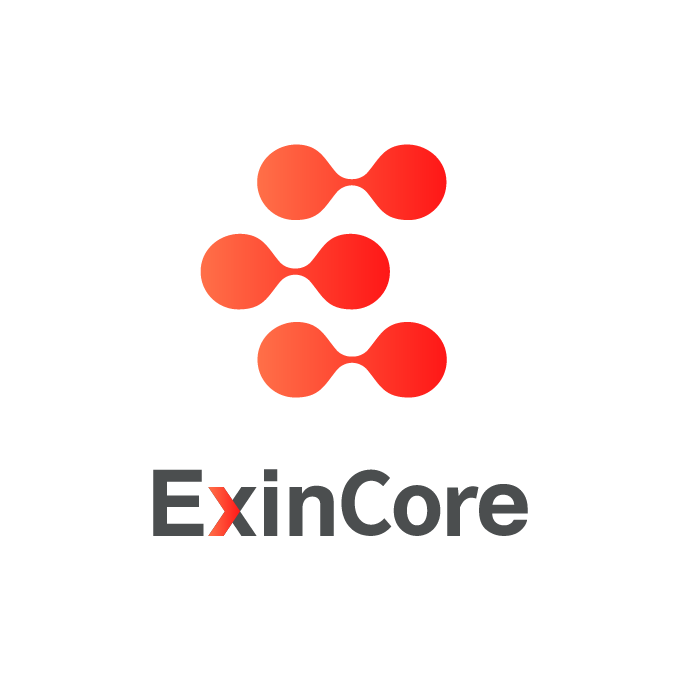

<p align="center"></p>
<p align="center">
<a href="README_cn.md"></a>
</p>

# ExinCore

ExinCore is a decentralized **instant exchange platform** built on [Mixin Network](https://mixin.one), to use ExinCore, just send a asset transfer to ExinCore, ExinCore will auto use API to trade in exchange like `Binance`, `Huobi Global`, `BigOne`, `Okex`, `FCoin`, ruturn to pay account after exchange, complete within 1 second.

All order and trade data are encoded in the Mixin snapshots' memo field, the memo is base64 encoded MessagePack.

ExinCore is available to professional users with programming skills, general user enjoy the Instant-Exchange service, and the OTC service at [ExinOne](https://exinone.com).

## Features

- **Safe**: decentralized exchange, keeping assets by yourself, and no need to trust ExinCore.
- **High Liquidity**: all pairs will connect to the best liquidity exchange to ensure trade at right market price.
- **Free**: Mixin Network is a free and lightning fast peer-to-peer transactional network for digital assets.
- **Fast**: API to exchanges trade, complete the transaction within 1 second.
- **Cross-chain**：ExinCore can support all assets supported by the Mixin Network, now support `BTC` `ETH` `BCH` `EOS` `USDT` and so on.

## Create Order

To exchange 10 USDT to BTC, send a 10 USDT transfer to ExinCore (61103d28-3ac2-44a2-ae34-bd956070dab1) with base64 encoded MessagePack data as the memo. [A example to test](https://exinone.com/exincore/test).

### Transfer

Reference the Mixin Network API Document:

https://developers.mixin.one/api/alpha-mixin-network/transfer/

### Memo Encode Example

**Golang**

Install the package:
```
// You can use other msgpack implementations.
go get -u github.com/vmihailenco/msgpack
```

Example:
```go
import (
    "encoding/base64"
    "github.com/satori/go.uuid"
    "github.com/vmihailenco/msgpack"
)

type OrderAction struct {
    A  uuid.UUID  // asset uuid
}

// Pack memo
packUuid, _ := uuid.FromString("c6d0c728-2624-429b-8e0d-d9d19b6592fa")
pack, _ := msgpack.Marshal(OrderAction{A: packUuid,})
memo := base64.StdEncoding.EncodeToString(pack)
// gaFBxBDG0McoJiRCm44N2dGbZZL6

// Parse memo
parsedpack, _ := base64.StdEncoding.DecodeString(memo)
orderAction := OrderAction{}
_ = msgpack.Unmarshal(parsedpack, &orderAction)
// c6d0c728-2624-429b-8e0d-d9d19b6592fa

```

**PHP**

Install the package:

```
composer require ramsey/uuid
composer require rybakit/msgpack
```

Example:

```php
require 'vendor/autoload.php';

use Ramsey\Uuid\Uuid;
use MessagePack\MessagePack;

// Pack memo
$memo = base64_encode(MessagePack::pack([
    'A' => Uuid::fromString("c6d0c728-2624-429b-8e0d-d9d19b6592fa")->getBytes(),
]));
// gaFBxBDG0McoJiRCm44N2dGbZZL6

// Parse memo
$uuid = Uuid::fromBytes(
    MessagePack::unpack(base64_decode($memo))['A']
)->toString();
// c6d0c728-2624-429b-8e0d-d9d19b6592fa
```

**Python**

Install the package:

```
pip install u-msgpack-python
```

Example:

```python
import uuid
import umsgpack
import base64

# Pack memo
memo = base64.b64encode(umsgpack.packb({
    "A": uuid.UUID("{c6d0c728-2624-429b-8e0d-d9d19b6592fa}").bytes
}))
# gaFBxBDG0McoJiRCm44N2dGbZZL6

# Parse memo
uuid = uuid.UUID(
    bytes=umsgpack.unpackb(base64.b64decode(memo))["A"]
)
# c6d0c728-2624-429b-8e0d-d9d19b6592fa
```

**Ruby**

Install the package:

```
// You can use other msgpack implementations.
sudo gem install msgpack
sudo gem install easy-uuid
```

Example:

```ruby
require 'msgpack'
require 'base64'
require 'uuid'

# Pack memo
memo = Base64.encode64(MessagePack.pack({
    'A' => UUID.parse("c6d0c728-2624-429b-8e0d-d9d19b6592fa").to_raw
}))
# gaFBxBDG0McoJiRCm44N2dGbZZL6

# Parse memo
uuid = UUID.parse(MessagePack.unpack(Base64.decode64(memo))["A"]).to_s
# c6d0c728-2624-429b-8e0d-d9d19b6592fa
```

**Node.js**

Install the package:

```
npm install msgpack5
```

Example:

```javascript
const msgpack = require('msgpack5')();

// Pack memo
const bytes = Buffer.from(
  'c6d0c728-2624-429b-8e0d-d9d19b6592fa'.replace(/-/g, ''),
  'hex'
);
const memo = msgpack
  .encode({
    A: bytes,
  })
  .toString('base64');

console.log(memo); // gaFBxBDG0McoJiRCm44N2dGbZZL6

// Parse memo
const buf = Buffer.from(memo, 'base64');
const hexStr = Buffer.from(msgpack.decode(buf).A).toString('hex');
const uuid = `${hexStr.slice(0,8)}-${hexStr.slice(8,12)}-${hexStr.slice(12,16)}-${hexStr.slice(16,20)}-${hexStr.slice(20)}`;
console.log(uuid); // c6d0c728-2624-429b-8e0d-d9d19b6592fa
```

## Instant Exchange Return

ExinCore will send asset to the pay account with base64 encoded MessagePack data as the memo.

```go
type OrderAction struct {
    C  integer    // code
    P  string     // price, only type is return
    F  string     // ExinCore fee, only type is return
    FA string     // ExinCore fee asset, only type is return
    T  string     // type: refund(F)|return(R)|Error(E)
    O  uuid.UUID  // order: trace_id
}

memo = base64.StdEncoding.EncodeToString(msgpack(OrderAction{
    C:  1000,
    P:  "0.46372",
    F:  "0.000023",
    FA: uuid.FromString("c6d0c728-2624-429b-8e0d-d9d19b6592fa"),
    T:  "F"
    O:  uuid.FromString("37af6bd0-ecb8-11e8-9be4-3be93718305e"),
}))

memo = base64.StdEncoding.EncodeToString(msgpack(OrderAction{
    C: 1000,
    T: "F"
    O: uuid.FromString("37af6bd0-ecb8-11e8-9be4-3be93718305e"),
}))
```

**Parameter Description**

|Parameter|Description|
|:---|:---|
|C   |[Code](#Code)|
|P   |The Exchange price includ exchange fee|
|F   |The amount of ExinCore fee|
|FA  |The UUID of ExinCore fee asset|
|T   |Transfer type. `F` is refund, refund will not happen if the memo is not valid base64 encoded MessagePack data. `R` is return after exchange success. `E` is error, such as insufficient funds pool, it will retry until successful.|
|O   |Order ID, the same as `trace_id`|

## API of Get Instant Exchange List

Get the ExinCore the support list of instent exchange with `base_asset `(optional), `exchange_asset`(optional)

```
GET https://exinone.com/exincore/markets?base_asset=815b0b1a-2764-3736-8faa-42d694fa620a

{
  "code": 0,
  "data": [
    {
      "base_asset": "815b0b1a-2764-3736-8faa-42d694fa620a",
      "base_asset_symbol": "USDT",
      "echange_asset": "c6d0c728-2624-429b-8e0d-d9d19b6592fa",
      "echange_asset_symbol": "BTC",
      "minimum_amount": "1",
      "maximum_amount": "100",
      "exchanges": ["Huobi Global"],
      "price": "5372"
    }
  ],
  "message": "success"
}
```

**Parameter Description**

|Parameter|Description|
|:---|:---|
|base\_asset             |The UUID of pay asset|
|base\_asset\_symbol     |The symbol of pay asset|
|echange\_asset          |The UUID of exchange asset|
|echange\_asset\_symbol  |The symbol of exchange asset|
|minimum\_amount         |The minimum of pay asset|
|maximum\_amount         |The maximum of pay asset|
|exchanges               |The exchange platforms|
|price                   |The trade price, `echange_asset` price/`base_asset` price, for reference only, subject to actual transaction price|

## Fee

- 0.2% of the filled part after December 15, 2018, and free before the time
- Deduct from the exchange asset
- Not support the *ExinOne Point Card* (EPC)

## Code

|Code |Type |Description |
|:-- |:-- |:-- |
|1000 |return |Successful Exchange |
|1001 |refund |The order not found or invalid |
|1002 |refund |The request data is invalid |
|1003 |refund |The market not supported |
|1004 |refund |Failed exchange |
|1005 |return\|refund |Partial exchange |
|1006 |error |Insufficient pool|
|1007 |refund |Below the minimum exchange amount |
|1008 |refund |Exceeding the maximum exchange amount |

## Contact

- Wechat：ThorbJ
- Email ：thorb@exin.one

## Base On

<p align="left">
  <a target="_blank" href="https://mixin.one">
    
  </a>
  &nbsp;
  <a target="_blank" href="https://www.huobi.com">
    
  </a>
  &nbsp;
  <a target="_blank" href="https://www.binance.com">
    
  </a>
  &nbsp;
  <a target="_blank" href="https://www.okex.com">
    
  </a>
  &nbsp;
  <a target="_blank" href="https://fcoin.com">
    
  </a>
  &nbsp;
  <a target="_blank" href="https://big.one">
    
  </a>
</p>


## Application

<p align="left">
  <a target="_blank" href="https://exinone.com">
    
  </a>
  &nbsp;
  <a target="_blank" href="https://exinpay.one">
    
  </a>
</p>
