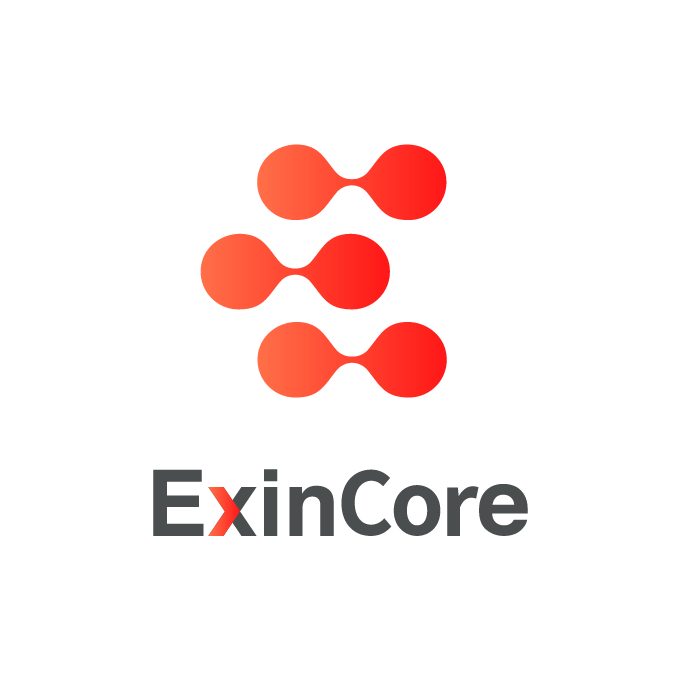

<p align="center"></p>
<p align="center">
<a href="README.md"></a>
</p>

# ExinCore

ExinCore 是基于 [Mixin Network](https://mixin.one) 的去中心化数字资产闪兑平台。只需要发送一笔包含拟兑换的数字币UUID转账给 ExinCore 账户，ExinCore 就对自动将交易通过 API 提交给相应的交易所（目前支持`币安` `火币全球` `BigOne` `Okex` `FCoin`），完成后将兑换后的数字币原路转回，整个过程不到1秒即可完成兑换。所有交易数据均编码后上链。

ExinCore 主要提供给具备开发能力的专业用户使用，普通用户使用 [ExinOne](https://exinone.com) 即可以享受去中心化的闪兑服务，ExinOne 同时还提供法币交易服务。


## 优势

- **安全**：去中心化交易，不托管资产，自己保管钱包，无需信任 ExinCore
- **流动性好**：每一个交易对都会对接流动性最好的交易所，确保市场价成交
- **便宜**：不同于链上转账，在 Mixin Networkd 转账无需手续费，交易手续费也仅收取 0.2%
- **快**：收到订单之后，我们会立即利用自由资金池在交易所交易，1秒之内即可完成整个交易转账过程
- **跨链**：理论上 ExinCore 可以支持所有 Mixin Network 支持的公链所有币，目前已经支持`BTC` `ETH` `BCH` `EOS` `USDT`等主流币种之间的兑换


## 创建订单

将 10 USDT 兑换为 BTC，只需要在 Mixin Network 上将 10 USDT 转给 ExinCore (61103d28-3ac2-44a2-ae34-bd956070dab1) 并携带经过 Base64 编码的 MessagePack 格式 Memo。[点击体验用例](https://exinone.com/exincore/test)

### 转账

请参考 Mixin Network 开发文档：

https://developers.mixin.one/api/alpha-mixin-network/transfer/

### Memo 编码示例

**Golang**

引入包：
```
// 可自行选择 msgpack 的实现
go get -u github.com/vmihailenco/msgpack
```

编码：
```golang
import (
    "encoding/base64"
    "github.com/satori/go.uuid"
    "github.com/vmihailenco/msgpack"
)

type OrderAction struct {
    A  uuid.UUID  // asset uuid
}

memo := base64.StdEncoding.EncodeToString(msgpack.Marshal(OrderAction{
    A: uuid.FromString("c6d0c728-2624-429b-8e0d-d9d19b6592fa"),
}))
```

**PHP**

安装 msgpack 扩展：

```
sudo pecl install msgpack
```

引入包：

```
composer require ramsey/uuid
```

编码：

```php
require 'vendor/autoload.php';

use Ramsey\Uuid\Uuid;

$memo = base64_encode(msgpack_pack([
    'A' => Uuid::fromString("c6d0c728-2624-429b-8e0d-d9d19b6592fa")->getBytes(),
]));
```

**Python**

引入包：

```
pip install msgpack
```

编码：

```python
import uuid
import msgpack
import base64

memo = base64.b64encode(msgpack.packb({
    "A": uuid.UUID("{c6d0c728-2624-429b-8e0d-d9d19b6592fa}").bytes
}))
```

**Ruby**

引入包

```
// 可自行选择 msgpack 的实现
sudo gem install msgpack
sudo gem install easy-uuid
```

编码：

```ruby
require 'msgpack'
require 'base64'
require 'uuid'

memo = Base64.encode64(MessagePack.pack({
    'A' => UUID.parse("c6d0c728-2624-429b-8e0d-d9d19b6592fa").to_raw
}))
```

## 交易返回

交易后返回相应数字币，备注中返回相关交易信息：

```golang
type OrderAction struct {
    C  integer    // code
    P  string     // price, only type is return
    F  string     // ExinCore fee, only type is return
    FA string     // ExinCore fee asset, only type is return
    T  string     // type: refund(F)|return(R)|Error(E)
    O  uuid.UUID  // order: trace_id
}

memo = base64.StdEncoding.EncodeToString(msgpack(OrderAction{
    C:  1000,
    P:  "0.46372",
    F:  "0.000023",
    FA: uuid.FromString("c6d0c728-2624-429b-8e0d-d9d19b6592fa"),
    T:  "F"
    O:  uuid.FromString("37af6bd0-ecb8-11e8-9be4-3be93718305e"),
}))

memo = base64.StdEncoding.EncodeToString(msgpack(OrderAction{
    C: 1000,
    T: "F"
    O: uuid.FromString("37af6bd0-ecb8-11e8-9be4-3be93718305e"),
}))
```

**参数说明**

|参数|描述|
|:---|:---|
|C|交易状态编码，详见下方[说明](#状态码)|
|P|成交价格，包含交易所手续费，如果交易不成功则为0|
|F|ExinCore 手续费|
|FA|ExinCore 手续费资产|
|T|转账类型，`F`表示refund退币，如果memo不是合法编码数据将不会退币，`R`表示return兑换返回，`E`表示error转账失败（比如突然资金池不足），将会以一笔小额EPC转账携带，资金池充裕后会重新发起转账|
|O|订单ID，与发起转移转账的`trace_id`相同|

## 兑换列表API

获取 ExinCore 支持的闪兑换列表，及兑换限额，支持参数包括`base_asset `(可选)，`exchange_asset`(可选)

```
GET https://exinone.com/exincore/markets?base_asset=815b0b1a-2764-3736-8faa-42d694fa620a

{
  "code": 0,
  "data": [
    {
      "base_asset": "815b0b1a-2764-3736-8faa-42d694fa620a",
      "base_asset_symbol": "USDT",
      "echange_asset": "c6d0c728-2624-429b-8e0d-d9d19b6592fa",
      "echange_asset_symbol": "BTC",
      "minimum_amount": "1",
      "maximum_amount": "100",
      "exchanges": ["Huobi Global"],
      "price": "5372"
    }
  ],
  "message": "success"
}
```

**参数说明**

|参数|描述|
|:---|:---|
|base\_asset|支付兑换的资产UUID|
|base\_asset\_symbol|支付兑换的资产|
|echange\_asset|兑换资产UUID|
|echange\_asset\_symbol|兑换资产|
|minimum\_amount|最少兑换数量(base_asset)，少于这个数字将退回|
|maximum\_amount|最多兑换数量(base_asset)，多余这个数字将退回|
|exchanges|交易平台，以实际成交为准|
|price|兑换价格，`echange_asset`价格/`base_asset`价格，仅供参考，以实际成交价为准|

## 手续费

- 2018年12月15日之前免费，之后收取成交部分的0.2%
- 从兑换后的数字币中扣除
- 暂不支持手续费点卡 (EPC) 抵扣

## 状态码

|状态码 |类型 | 描述 |
|:-- |:-- |:-- |
|1000 |return |交易成功 |
|1001 |refund |订单不存在或者交易非法 |
|1002 |refund |请求数据非法 |
|1003 |refund |交易对不支持 |
|1004 |refund |交易失败 |
|1005 |return\|refund |部分成交 |
|1006 |error |资金池不足 |
|1007 |refund |低于最少兑换金额 |
|1008 |refund |多于最大兑换金额 |

## 联系我们

- 微信：ThorbJ
- 邮箱：thorb@exin.one

## 基于

<p align="left">
  <a target="_blank" href="https://mixin.one">
    
  </a>
  &nbsp;
  <a target="_blank" href="https://www.huobi.com">
    
  </a>
  &nbsp;
  <a target="_blank" href="https://www.binance.com">
    
  </a>
  &nbsp;
  <a target="_blank" href="https://www.okex.com">
    
  </a>
  &nbsp;
  <a target="_blank" href="https://fcoin.com">
    
  </a>
  &nbsp;
  <a target="_blank" href="https://big.one">
    
  </a>
</p>


## 谁在用

<p align="left">
  <a target="_blank" href="https://exinone.com">
    
  </a>
  &nbsp;
  <a target="_blank" href="https://exinpay.one">
    
  </a>
</p>
